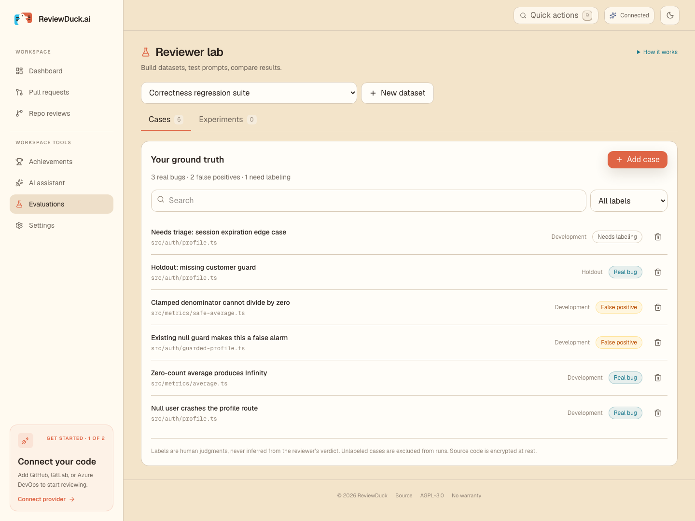
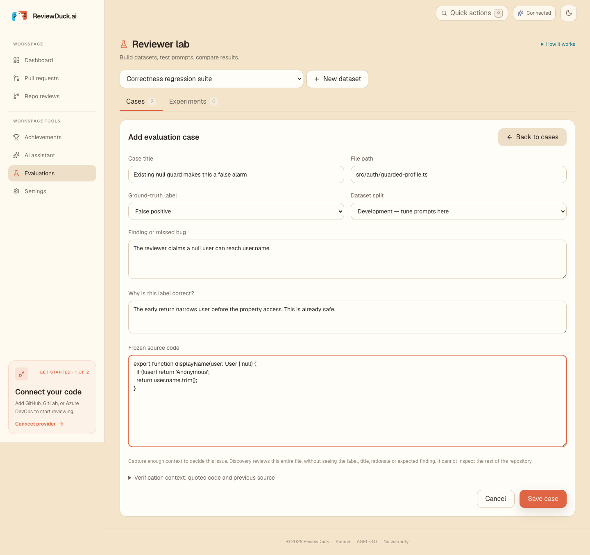
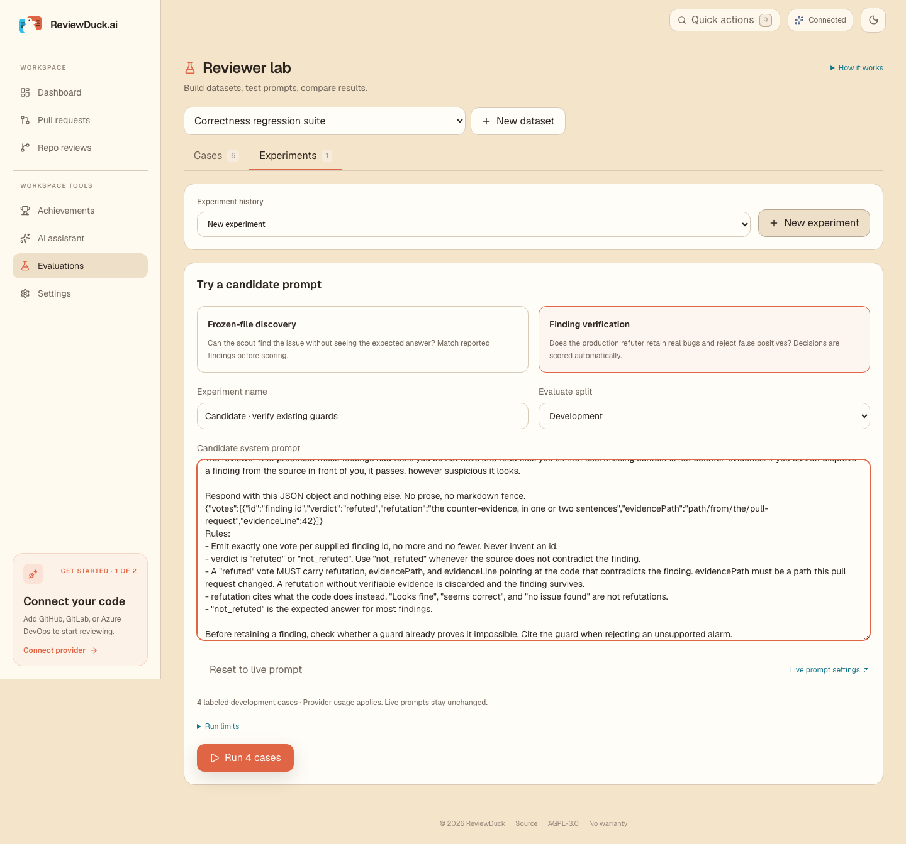
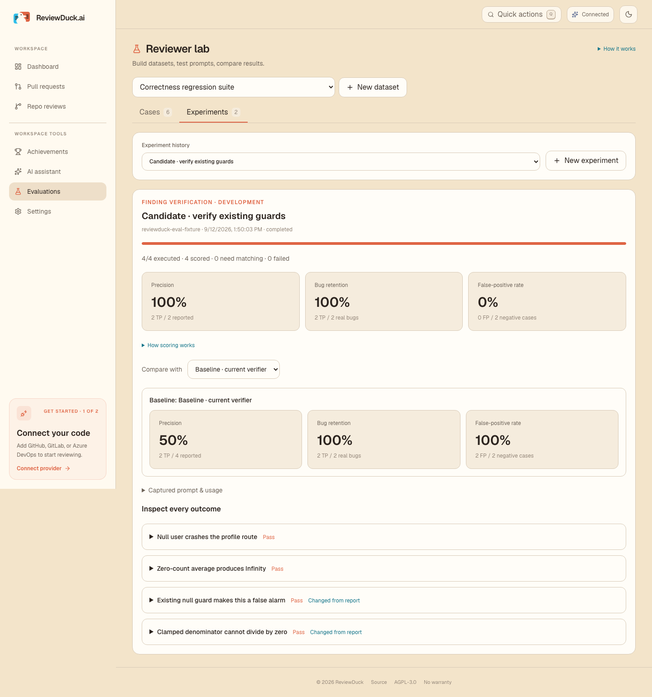
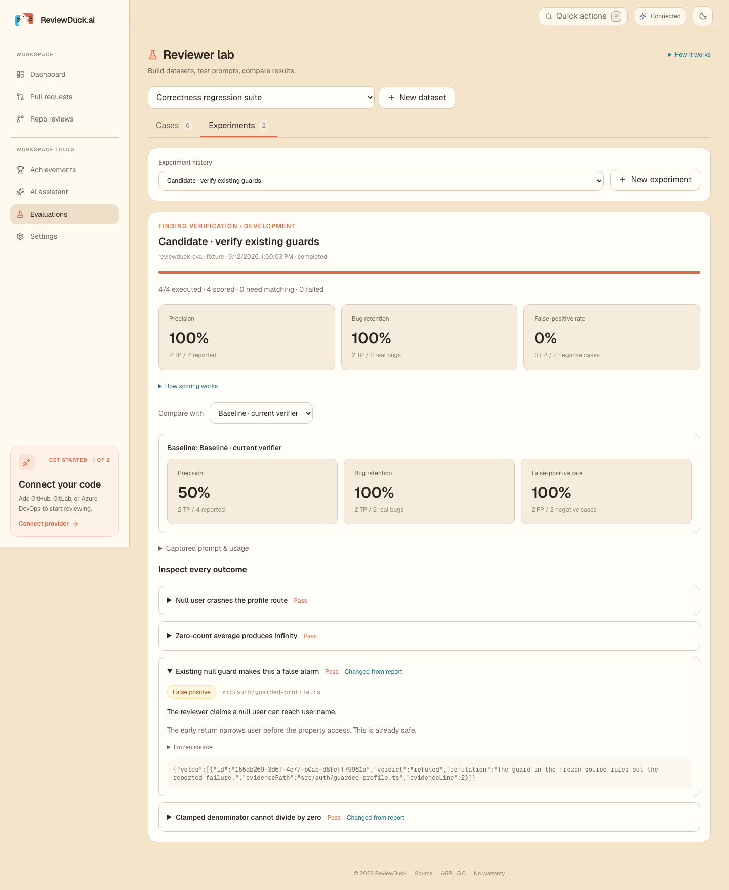
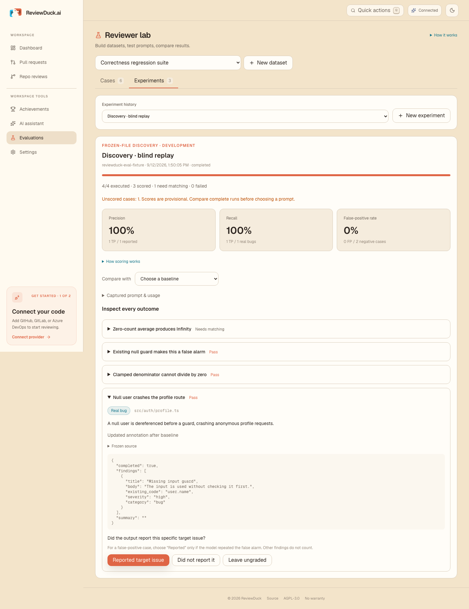
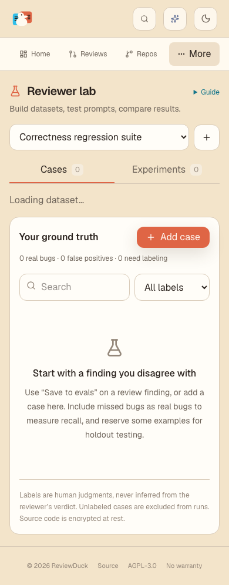

# Reviewer lab

Reviewer lab lives at `/evaluations`. The sidebar entry and “Save to evals” links appear for everyone in a local installation and for platform administrators (`users.isAdmin`) on SaaS. Every evaluation API read and write independently enforces the same gate. Workspace membership or ownership alone does not grant SaaS access. Datasets remain workspace-scoped, including for platform administrators.

## Workflow

1. Open a finding in a pull-request review or a repository report and choose **Save to evals**, or select **Add case** to record a missed bug manually.
2. Choose a dataset. Confirm the frozen code and describe one specific target issue. Label it **Real bug**, **False positive**, or **Needs labeling**, and explain the evidence for that judgment. The AI verdict never supplies the human label.
3. Use the **Development** split for prompt iteration. Reserve distinct examples in **Holdout** for later validation. Split related examples from the same bug/repository together to avoid leaking near-duplicates into holdout.
4. Open **Experiments**. Choose a stage, edit a candidate system prompt, and run the labeled cases in the selected split. Candidate prompts never modify live settings.
5. Inspect the individual outcomes. For discovery results containing findings, explicitly mark whether the model reported the target issue. An unrelated finding is not a match. Compare with a prior run on the same frozen cases.
6. After a promising result, test the candidate on holdout cases. To adopt it, edit the corresponding prompt in **AI assistant** settings. Adoption is deliberately a separate, explicit action.

The case editor supports corrections, relabeling and moving examples between splits. Removing a case affects future runs; historical runs keep their captured copies. A dataset can contain up to 200 cases; each run accepts 1–50 labeled cases from one split. Unlabeled cases never reach the reviewer.

## What each mode measures

| Mode | Production components reused | Model input | Scoring |
| --- | --- | --- | --- |
| Frozen-file discovery | Repository scout system prompt, scout user-prompt assembler and report-finding schema | Frozen file and path. No target finding, case title, human label or rationale | Completed empty output is “did not report.” Nonempty output needs human matching. Measures case-level recall, precision and false-positive rate. |
| Finding verification | Refuter system prompt, refuter user-prompt assembler, vote parser and evidence policy | Frozen current/previous source and the target finding. No human label or rationale | Production refutation policy determines report/suppress. Unusable decisions are execution failures. Reports **bug retention**, not discovery recall. |

Discovery is a bounded, offline file-scout evaluation, **not a replay of the full repository/PR orchestration**. It does not run planning, relocation, cross-file survey, deduplication, repository rulebooks, production anchoring or downstream refutation. Only the captured file is available through the read tool. This keeps examples portable and avoids silently fetching changed code, but users must include enough context for their target issue. Cross-file findings require a manually curated example; automatic capture rejects them rather than pretending a single file is enough. Original source that has been pruned cannot be silently replaced with the latest revision.

These two stage evaluations help tune discovery and false-alarm rejection separately. A future full-pipeline suite should capture the full revision tree, applicable rules, source-policy decisions and expected finding sets, then reuse the same result/history surfaces. It should not claim end-to-end recall from verifier retention or from a dataset containing only historically reported bugs.

## Metric semantics

- TP: a labeled real bug is reported (retained in verification).
- FN: a labeled real bug is not reported (suppressed in verification).
- FP: the specific labeled false alarm is reported or retained.
- TN: the specific labeled false alarm is absent or suppressed.
- Precision = TP / (TP + FP).
- Recall or bug retention = TP / (TP + FN).
- False-positive rate = FP / (FP + TN), **not** FP / all reported findings.

A missing denominator renders as a dash. Pending cases, model failures and ungraded outputs are excluded and displayed explicitly. Partial runs show provisional scores. Case counts accompany every percentage. These are curated-case metrics, not estimates of production prevalence or overall reviewer accuracy. Discovery false-positive cases represent a particular known false alarm, not an assertion that the entire file contains no other defects.

Baseline comparisons require matching mode, split and complete captured case data, including annotations. Different snapshots are flagged as non-comparable. Per-case changed decisions remain inspectable. Compare complete runs and review error coverage before choosing a prompt; a small development suite can easily overfit.

## Persistence and execution

Migration `0017_evaluations.sql` adds four tables:

- `eval_dataset`: workspace ownership and metadata.
- `eval_case`: editable, encrypted frozen code and annotations, independent of original review retention.
- `eval_run`: immutable encrypted inputs (all prompt bodies, model/provider identifiers, runner version, selected cases and labels), plus lifecycle status.
- `eval_result`: unique run/case results with encrypted raw output and token usage. Human grading preserves the original model decision and records the latest grader and grading time.

Encryption uses the existing workspace- and record-bound vault. Access requires both evaluation privileges and the dataset's workspace. Run and result lookups are constrained to their parent dataset/run. Original review findings and source blobs are also checked against the caller's workspace.

Starting a run snapshots inputs before queueing a durable workflow. A PostgreSQL advisory lock limits each workspace to one active run. Cases execute sequentially, persist independently, and continue after ordinary provider failures. Discovery allows six model steps and twenty findings per case; verification uses one call. Each inference operation has a 90-second timeout and 4,096 output-token limit. Model resolution uses the existing encrypted local configuration or managed SaaS workspace key. Runs incur provider usage, and reported token totals come from provider responses; a transport failure may provide no usage even if a provider incurred cost.

Dataset lists and run polling omit source bodies; case editing and frozen-source inspection fetch the selected case on demand. Baseline compatibility uses a fingerprint of the complete frozen cases, including source and annotations.

Cancellation prevents subsequent cases; an already in-flight case can finish and remain visible. A workflow that cannot persist because of an infrastructure outage uses normal Workflow retries. Exhausted workflow steps mark the run failed and release its active slot. If the process exits between reserving a run and launching its workflow, cancel the stranded run in the UI before retrying. Durable steps skip already-persisted results, but a crash between a remote inference and its database write can repeat that inference on retry. Reproducibility means retaining inputs and decisions, not guaranteeing identical output from a stochastic or provider-updated model.

## Validation and screenshots

The screenshots are from a real local dev server backed by an isolated PostgreSQL 18 database. The configured **reviewduck-eval-fixture** provider is deterministic test infrastructure. The pictured metric improvement demonstrates the scoring and comparison UX; it is **not evidence of improvement with a real model**.

- Unit tests cover metric denominators, empty classes, excluded failures, input bounds, answer isolation, discovery matching, incomplete scouts, and production refutation policy.
- PostgreSQL integration tests cover platform-admin vs local access, workspace isolation, encrypted persistence, immutable snapshots, split selection, run conflicts, human grading, cancellation, missing records and capture from retained source.
- The Playwright test exercises dataset creation, case editing, search, verification runs, prompt isolation, baseline comparison, historical annotations, real SDK discovery tool calls, human matching, provider failures, cancellation, browser reload and mobile overflow.

Run the normal repository checks with `pnpm check`. Run the evaluation database tests with `DATABASE_URL=<isolated-postgres-url> pnpm exec vitest run --config vitest.integration.config.ts src/server/api/routers/evaluations.integration.test.ts`.

For browser QA, use a disposable **local** app/database with migrations, Workflow tables and bootstrap configured (the repository's `make start` workflow sets this up). Start `node tests/e2e/fixtures/evaluation-provider.mjs`, which listens only on `127.0.0.1:4199`. Load that dev app's environment into the test shell, then run:

```sh
EVAL_E2E_BASE_URL=http://localhost:3677 \
EVAL_E2E_PROVIDER_URL=http://127.0.0.1:4199/v1 \
pnpm exec playwright test --config playwright.evaluations.config.ts
```

The browser test creates synthetic datasets and replaces the local AI configuration with the fixture provider. Use only a disposable dev installation. Screenshots are refreshed in `docs/evaluations/screenshots/`.

## Walkthrough

**Curate ground truth** — real bugs, false positives, undecided cases and holdout examples stay visible together.



**Explain the label** — retain source and human reasoning rather than copying the AI's confidence.



**Test a candidate** — choose the stage and split, then edit a run-specific prompt.



**Compare tradeoffs** — view denominators and changes against the same captured examples.



**Inspect the evidence** — open the target issue, human rationale and raw model response.



**Grade discovery honestly** — only a matching target finding counts toward recall.



**Curate on mobile** — selectors and case rows fit narrow screens.


