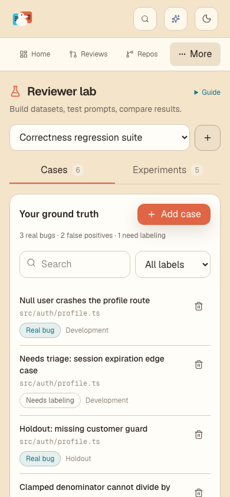
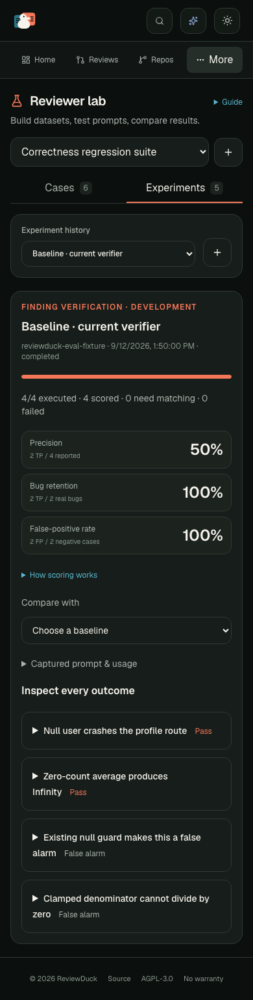

# Responsive visual review

## Full-width layout alignment

Evaluations uses the shared `PageContainer`, including its full-width layout and responsive page padding. Its heading follows the Repo reviews hierarchy, and the guide uses the shared secondary button styling in normal header flow so it cannot overlap the title. Dataset creation, cases, the case editor, prompt composition and results all inherit the same container.

Fixture-rendered component previews were checked at 320, 768, 1440 and 2330 pixels: all five views filled the available width without document overflow. The expanded guide also fit at 320 pixels. TypeScript and the scoped Biome checks passed. The existing end-to-end workflow now includes an ultrawide viewport and checks the main container against its available width; the provider-backed workflow was not rerun for this layout change.

## Earlier workflow review

The screenshots below predate the full-width alignment.

The lab now uses a compact workspace header, a dataset selector with an adjacent create action, and consistent view tabs. The introductory guide is available on demand. On phones, case labels sit beneath full-width titles, experiment history uses a bounded selector, the review stage uses a native selector, and metrics use aligned rows. Editors wrap their controls and constrain source/prompt scrolling. Scoring explanations and run limits remain accessible in disclosures.

The earlier visual review covered 320, 390, 768 and 1440 pixel viewports, plus light and dark themes. The browser regression test checks document overflow in the dataset, case editor, results and prompt composer, and keeps the dataset heading in the initial viewport. Screenshots omit only the Next.js development indicator.

Validation: `pnpm check` passed (2,581 unit tests), and the expanded evaluation Playwright workflow passed. The examples and model responses use the deterministic QA provider.

| View | Small phone (320 px) | Tablet (768 px) | Desktop (1440 px) |
| --- | --- | --- | --- |
| Dataset | [Screenshot](screenshots/responsive-cases-320.png) | [Screenshot](screenshots/responsive-cases-768.png) | [Screenshot](screenshots/responsive-cases-1440.png) |
| Case editor | [Screenshot](screenshots/responsive-editor-320.png) | [Screenshot](screenshots/responsive-editor-768.png) | [Screenshot](screenshots/responsive-editor-1440.png) |
| Prompt composer | [Screenshot](screenshots/responsive-prompt-320.png) | [Screenshot](screenshots/responsive-prompt-768.png) | [Screenshot](screenshots/responsive-prompt-1440.png) |
| Results | [Screenshot](screenshots/responsive-results-320.png) | [Screenshot](screenshots/responsive-results-768.png) | [Screenshot](screenshots/responsive-results-1440.png) |

## Initial phone viewport

## Dark theme

